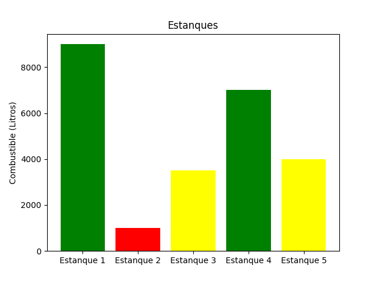

# Gestión de Estanques de Combustible 

Este proyecto es un programa en **Python** que permite gestionar cargas, descargas, transferencias y ajustes de precio en distintos estanques de combustible.  
Incluye visualización gráfica del nivel de combustible en cada estanque para una interpretación rápida del estado.

---

## Descripción

El sistema simula la operación de una estación de almacenamiento de combustibles, donde se pueden realizar las siguientes acciones:

- Mostrar el nivel actual de combustible en cada estanque.  
- Cargar combustible en un estanque (respetando la capacidad máxima).  
- Descargar combustible (verificando que no quede en valores negativos).  
- Transferir combustible de un estanque a otro.  
- Ajustar el precio asociado a cada estanque.  
- Visualizar gráficamente los niveles de combustible mediante un gráfico de barras.

## Ejemplo de uso

1.- Al iniciar el programa se muestra un menú interactivo:

--------------- Menú principal ---------------
1. Mostrar combustible
2. Cargar combustible
3. Descargar combustible
4. Transferir combustible
5. Ajustar precio
6. Salir
Ingrese opción:

2.- Carga de combustible en el Estanque 2:

---------- Carga de combustible ----------
 Estanques   Combustible
 Estanque 1            0
 Estanque 2            0
 Estanque 3            0
 Estanque 4            0
 Estanque 5            0
Seleccione estanque (1,2,3,4,5): 2
Ingrese cuánto combustible quiere cargar: 3000
La carga del estanque 2 con 3000 litros ha sido realizada.

3.- Visualización de gráficos:

Se abre una ventana mostrando un gráfico de barras donde cada estanque se representa con un color según el nivel:

Rojo → bajo (< 2000 litros)
Amarillo → medio (2000 a 5999 litros)
Verde → alto (≥ 6000 litros)

## Resultados esperados

Operaciones válidas de carga, descarga y transferencia entre estanques.
Validación de entradas para evitar valores incorrectos.
Visualización gráfica del estado actual de los estanques.
Tabla en consola con la información de cada estanque: nombre, cantidad de combustible y valor asignado.

## Habilidades de Python demostradas

Uso de listas y condicionales para control de niveles de combustible.
Creación y uso de funciones para modularizar el código.
Manejo de errores con try-except para entradas inválidas.
Uso de f-strings para formatear salidas de texto.
Trabajo con Pandas para representar datos en tablas.
Visualización de datos con Matplotlib.
Implementación de un menú interactivo en consola.