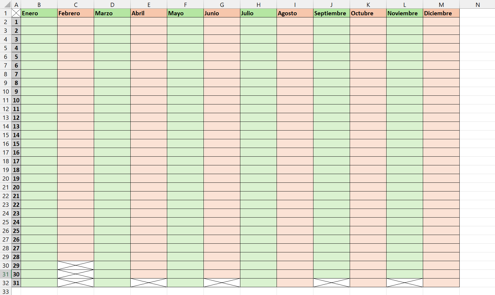
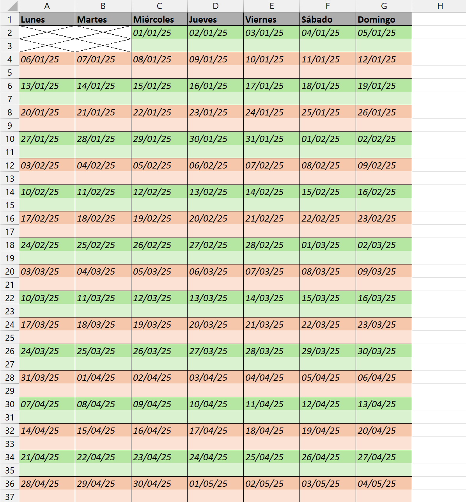

# PROYECTO 1: AGENDA ANUAL EN EXCEL

## DESCRIPCIÓN  
Este proyecto consistió en crear una agenda anual en Excel, organizada de manera funcional y clara.  
Se realizaron dos versiones de la agenda:  
- **Opción A:** Filas como días (1–31) y columnas como meses (enero–diciembre).  
- **Opción B:** Filas como semanas y columnas como días de la semana.  

El objetivo fue aplicar conocimientos básicos de Excel para generar un archivo útil y visualmente ordenado.

---

## OBJETIVO  
- Practicar la creación de tablas y secuencias de datos mediante **autorrelleno**.  
- Aplicar **estilos de fuente, colores y alineación** para mejorar la legibilidad.  
- Organizar la información de manera clara para un uso práctico durante todo el año.  

---

## INSTRUCCIONES SEGUIDAS  
1. Crear un nuevo libro de Excel.  
2. Generar los días y meses utilizando autorrelleno.  
3. Diseñar las agendas en dos formatos:  
   - Opción A: días como filas y meses como columnas.  
   - Opción B: semanas como filas y días como columnas.  
4. Aplicar estilos de **fuente**, negrita, cursiva, colores de fondo y alineación de celdas.   

---

## RESULTADO FINAL  
- Se crearon dos agendas totalmente funcionales, listas para su uso durante todo el año.  
- La información está organizada y visualmente clara gracias a estilos aplicados.  
- El archivo permite fácil navegación y edición futura, respetando buenas prácticas de diseño de tablas en Excel.  

---

## VISTA PREVIA  

**Agenda Anual - Forma A**

**Agenda Anual - Forma B**
