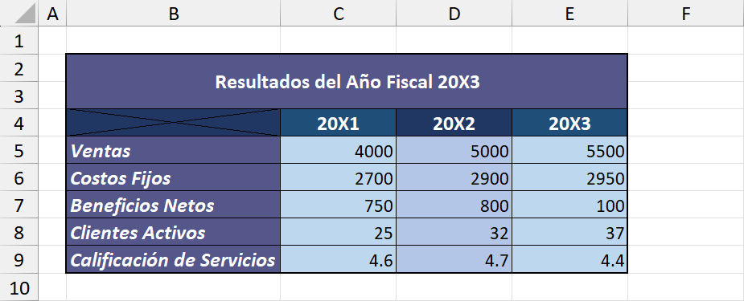

# PROYECTO 2: FORMATO DE TABLA CORPORATIVA

## DESCRIPCIÓN  
Este proyecto consistió en transformar una planilla sin formato en una tabla clara, profesional y atractiva para su presentación a un gerente.  
El objetivo fue aplicar herramientas de formato en Excel para resaltar la información y mejorar la legibilidad, manteniendo la identidad visual de la empresa ficticia proporcionada en el ejercicio.

---

## OBJETIVO  
Aplicar lo aprendido sobre:  
- Fuentes, tamaños y colores.  
- Relleno de celdas, bordes y alineación.  
- Combinar celdas y ajustar su tamaño.  
- Copiar formatos entre celdas para mantener coherencia visual.  

El resultado final debía presentar la información de manera profesional, clara y fácil de interpretar.

---

## INSTRUCCIONES SEGUIDAS  
1. Aplicar diferentes estilos de **fuente, tamaño y color** para destacar secciones relevantes de la tabla.  
2. Utilizar **relleno de celdas** y **bordes** para separar y organizar visualmente la información.  
3. Ajustar la **alineación** para mejorar la lectura de los datos.  
4. **Combinar celdas** y modificar su tamaño para dar estructura al título y encabezados.  
5. Copiar el formato de la celda **A1** y aplicarlo al título de la tabla, respetando los colores corporativos de la empresa ficticia.  

---

## RESULTADO FINAL  
- La planilla pasó de ser un archivo plano a una tabla profesional y atractiva.  
- Se respetaron los colores corporativos brindados en la celda de referencia.  
- La información quedó organizada con jerarquía visual, facilitando la lectura y análisis de los datos.  

---

## VISTA PREVIA   

