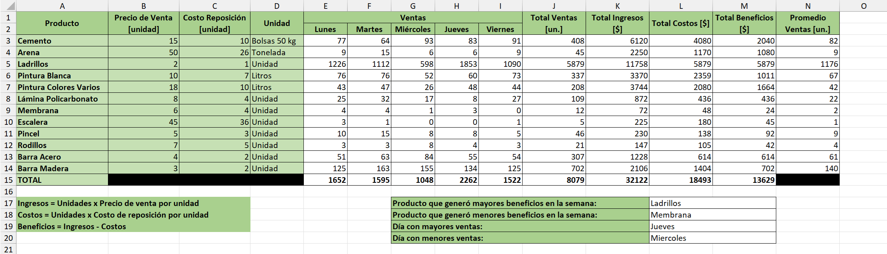

# PROYECTO 3: ANÁLISIS DE VENTAS SEMANALES

## DESCRIPCIÓN  
Este proyecto simuló el trabajo en una empresa de productos de construcción.  
El objetivo fue analizar las ventas semanales de distintos productos a partir de una planilla con información de precios, costos, unidades vendidas y otros datos relevantes.  

---

## OBJETIVO  
Aplicar operaciones básicas de Excel para obtener métricas clave de gestión comercial:  
- Totales y promedios de ventas.  
- Ingresos, costos y beneficios.  
- Identificación de productos y días con mejor y peor rendimiento.  

---

## INSTRUCCIONES SEGUIDAS  
1. Calcular los siguientes campos para cada producto:  
   - **Total de Ventas** = suma de unidades vendidas en la semana.  
   - **Total de Ingresos** = total de ventas × precio de venta.  
   - **Total de Costos** = total de ventas × costo de reposición.  
   - **Beneficios** = ingresos − costos.  
   - **Ventas Promedio** = promedio de unidades vendidas por día.  
   - **Totales generales** de todos los campos (excepto el de Ventas Promedio).  

2. Analizar los resultados obtenidos:  
   - Identificar el producto con **mayor beneficio** y el de **menor beneficio**.  
   - Determinar el día con **más ventas** y el día con **menos ventas**.  

---

## RESULTADO FINAL  
- Se generó una tabla con cálculos completos y totales generales.  
- Se destacaron los productos más y menos rentables.  
- Se identificaron los días con mayor y menor volumen de ventas.  
- El análisis permitió obtener conclusiones rápidas sobre el desempeño semanal de la empresa.  

---

## VISTA PREVIA  

