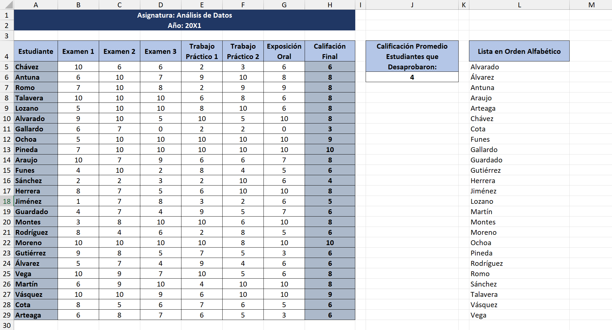

# PROYECTO 4: PROMEDIO DE CALIFICACIONES

## DESCRIPCIÓN  
Este proyecto trabajó con una planilla que contenía las calificaciones de varios estudiantes.  
El objetivo fue calcular los promedios individuales y globales de manera clara, redondeada y organizada, aplicando funciones combinadas y formatos adecuados en Excel.  

---

## OBJETIVO  
Aplicar lo aprendido sobre:  
- Funciones de promedio y redondeo.  
- Formatos numéricos para ocultar decimales.  
- Fórmulas matriciales.  
- Ordenamiento de datos alfabéticamente.  

Todo para transformar un listado de calificaciones en un reporte de notas finales fácil de interpretar.  

---

## INSTRUCCIONES SEGUIDAS  
1. Calcular el **promedio de las calificaciones** de cada alumno.  
2. Redondear los valores al número entero más cercano.  
3. Aplicar formato de número para **ocultar los decimales** en la tabla.  
4. Combinar funciones en una sola celda para que promedio y redondeo se apliquen al mismo tiempo.  
5. Calcular el **promedio de los alumnos no aprobados** (promedios menores a 6) utilizando una fórmula matricial.  
6. Ordenar alfabéticamente los nombres de los estudiantes (en versiones recientes de Excel).  

---

## RESULTADO FINAL  
- Cada alumno cuenta con un promedio final expresado en enteros.  
- Los alumnos no aprobados fueron analizados mediante un promedio específico.  
- La tabla quedó organizada alfabéticamente para una mejor presentación.  
- Se aplicaron fórmulas combinadas y matriciales para automatizar los cálculos.  

---

## VISTA PREVIA  

