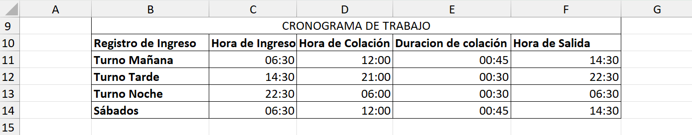

# PROYECTO 5: CRONOGRAMA DE TRABAJO

## DESCRIPCIÓN  
Este proyecto consistió en reorganizar un cronograma de trabajo de un establecimiento que funciona las 24 horas de lunes a viernes, y únicamente durante la mañana los sábados.  
El archivo original se encontraba desordenado y difícil de interpretar, por lo que el objetivo fue darle una estructura clara, lógica y fácil de leer.

---

## OBJETIVO  
Aplicar lo aprendido sobre:  
- Reordenar filas y columnas.  
- Insertar nuevas columnas con información adicional.  
- Copiar y ajustar filas existentes.  
- Ocultar filas innecesarias.  
- Usar funciones de texto en Excel.  

Todo con el fin de transformar una tabla confusa en un cronograma profesional y organizado.

---

## INSTRUCCIONES SEGUIDAS  
1. Reordenar las filas en el orden: **Turno Mañana → Turno Tarde → Turno Noche**.  
2. Reordenar las columnas en el orden: **Hora de ingreso → Hora de colación → Duración de colación → Hora de salida**.  
3. Insertar la columna **Duración de Colación** y calcular su valor.  
4. Copiar la fila de **Turno Mañana** al final de la tabla para representar los sábados, modificando el encabezado.  
5. Aplicar la función **MAYÚSCULAS** para generar un encabezado automático con el texto “Cronograma de Trabajo”.  
6. Ocultar las filas que contenían instrucciones.  
7. Eliminar las filas en blanco que quedaban antes del encabezado.  

---

## RESULTADO FINAL  
- El cronograma quedó estructurado en orden cronológico y con la información esencial bien organizada.  
- Se añadió una columna adicional para mostrar la duración de la colación.  
- El encabezado se automatizó con funciones de Excel.  
- El archivo final presenta una tabla clara, funcional y lista para ser utilizada como referencia.  

---

## VISTA PREVIA  

