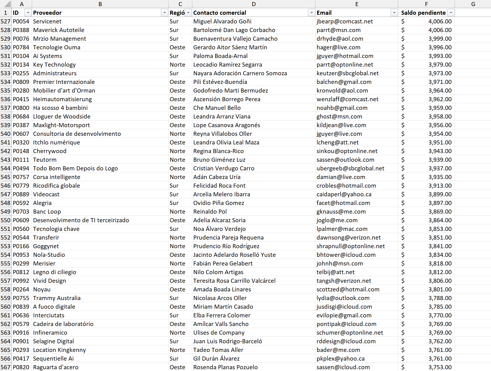

# PROYECTO 6: ANÁLISIS DE PROVEEDORES Y SALDOS PENDIENTES

## DESCRIPCIÓN  
Este proyecto trabajó con una base de datos de 1000 proveedores con saldos pendientes.  
El objetivo fue filtrar, ordenar y analizar los proveedores de la región "Este", mostrando los resultados mediante una tabla organizada y un gráfico en Excel.

---

## OBJETIVO  
Aplicar lo aprendido sobre:  
- Inmovilizar paneles y encabezados.  
- Ordenar registros de manera ascendente o descendente.  
- Filtrar datos según criterios específicos.  
- Copiar información a nuevas hojas y aplicar formatos de presentación.  
- Crear gráficos para visualizar resultados de manera clara y profesional.  

---

## INSTRUCCIONES SEGUIDAS  
1. Inmovilizar la fila de encabezados para mantener la referencia de las columnas visible al desplazarse.  
2. Ordenar la tabla según la columna **Saldo pendiente** (columna F) de mayor a menor.  
3. Aplicar un filtro para mostrar únicamente los proveedores de la región **"Este"**.  
4. Copiar la tabla filtrada a una **nueva hoja**.  
5. Aplicar formato de relleno y bordes a la nueva tabla para mejorar la presentación.  
6. Seleccionar las columnas de **Nombre del proveedor** y **Saldo pendiente** e insertar un gráfico de columnas que refleje los saldos de mayor a menor.  

---

## RESULTADO FINAL  
- Se obtuvo una tabla filtrada y ordenada con los proveedores de la región "Este".  
- La información se presentó de manera clara mediante bordes y rellenos de celda.  
- Se creó un gráfico de columnas que permite visualizar de manera rápida los proveedores con mayores saldos pendientes.  
- La hoja final es profesional, organizada y lista para ser utilizada como reporte o análisis interno.  

---

## VISTA PREVIA  

**Datos de Proveedores**

**Datos Filtrados + Grafico**
