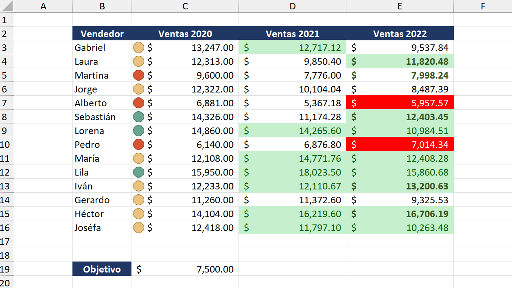

# PROYECTO 7: FORMATO CONDICIONAL PARA ANÁLISIS DE VENTAS

## DESCRIPCIÓN  
Este proyecto trabajó con un informe de ventas de diferentes vendedores a lo largo de tres años (2020, 2021 y 2022).  
El objetivo fue aplicar **formatos condicionales avanzados** para resaltar automáticamente información relevante, facilitando la interpretación y análisis del desempeño de cada vendedor.

---

## OBJETIVO  
- Aplicar y administrar reglas de **formato condicional** en Excel.  
- Usar iconos, colores y fuentes para destacar patrones en los datos.  
- Incorporar **percentiles y fórmulas** dentro de reglas condicionales.  
- Garantizar que las reglas se apliquen correctamente y en el orden adecuado.  

---

## INSTRUCCIONES SEGUIDAS  

### Ventas 2020
- Eliminar reglas existentes que no correspondían.  
- Agregar íconos tipo semáforo:  
  - Rojo: 50% de los vendedores con menores ventas.  
  - Amarillo: valores intermedios.  
  - Verde: 20% de los vendedores con mayores ventas.  
- Utilizar percentiles para determinar los rangos.  

### Ventas 2021
- Modificar la regla preexistente de "Inferior al promedio" a **"Superior al promedio"**.  
- Aplicar relleno verde claro y color de fuente verde oscuro a los valores que superan el promedio del año.  

### Ventas 2022
- Destacar a quienes no alcanzaron el objetivo de ventas de la celda C19 (relleno rojo, fuente blanca), usando la opción **"Detener si es verdad"**.  
- Crear una nueva regla con fórmula `=E3>D3` para resaltar a quienes superaron el monto del año anterior (negrita, fuente verde oscuro).  
- Modificar la regla de valores mayores a 10.000 (relleno verde claro, fuente verde oscuro) y ubicarla al final del listado de reglas.  

---

## RESULTADO FINAL  
- Se aplicaron múltiples reglas de formato condicional de manera correcta y ordenada.  
- Los semáforos y colores permiten identificar rápidamente los vendedores con mejores y peores resultados por año.  
- La hoja de cálculo quedó profesional, organizada y lista para análisis rápido de desempeño.  
- Se documentaron los cambios realizados en cada año para asegurar la trazabilidad de las reglas.  

---

## VISTA PREVIA  

