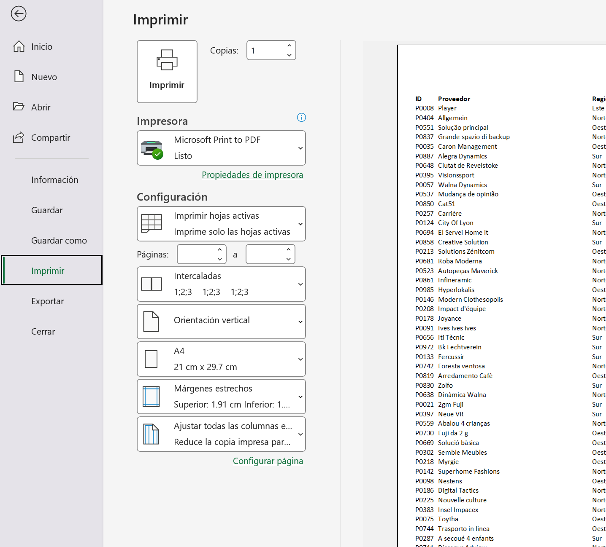

# PROYECTO 8: CONFIGURACIÓN DE IMPRESIÓN EN EXCEL

## DESCRIPCIÓN  
Este proyecto consistió en preparar un archivo de Excel para su impresión, aplicando todas las herramientas vistas en clase para ajustar la presentación y evitar desperdicio de papel.  
Para simular la impresión, el archivo fue exportado como PDF.  

---

## OBJETIVO  
- Configurar correctamente un libro de Excel para imprimirlo en la cantidad de hojas necesarias.  
- Ajustar el tamaño y distribución de los datos para mejorar la legibilidad.  
- Eliminar elementos innecesarios como las líneas de impresión.  
- Simular una impresión sin desperdiciar papel utilizando la opción de guardar como PDF.  

---

## INSTRUCCIONES SEGUIDAS  
1. Seleccionar un archivo de Excel existente para el proyecto.  
2. Estudiar la extensión de los datos utilizando atajos de teclado para desplazarse eficientemente.  
3. Configurar la impresión para que los datos se ajusten correctamente a la cantidad de hojas necesarias.  
4. Eliminar las líneas de impresión de la hoja.  
5. Revisar que la disposición sea clara y profesional.  
6. Guardar el archivo como PDF para simular la impresión.  

---

## RESULTADO FINAL  
- El archivo quedó preparado para impresión de manera profesional y legible.  
- Se eliminaron las líneas de impresión y se ajustó la distribución para ocupar la menor cantidad de hojas posible.  
- La exportación a PDF permite simular la impresión real sin desperdiciar papel.  
- La hoja final es clara, organizada y lista para compartir o imprimir según sea necesario.  

---

## VISTA PREVIA  

