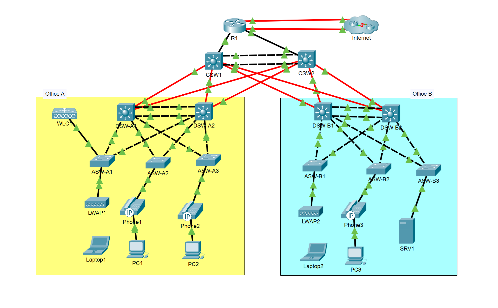

# Jeremy's IT Lab CCNA Mega Lab

Este laboratorio de Packet Tracer cubre todas las configuraciones esenciales de CCNA, incluyendo routing, switching, VLANs, HSRP, seguridad, IPv6 y servicios de red.

---

## Índice de Contenidos

1. [Configuración Inicial](#configuración-inicial)
2. [VLANs y EtherChannel](#vlans-y-etherchannel)
3. [Direcciones IP, Layer-3 EtherChannel y HSRP](#direcciones-ip-layer-3-etherchannel-y-hsrp)
4. [Rapid Spanning Tree Protocol](#rapid-spanning-tree-protocol)
5. [Servicios de Red](#servicios-de-red)
6. [Seguridad: ACLs y Layer-2](#seguridad-acls-y-layer-2)
7. [IPv6](#ipv6)
8. [Redes Inalámbricas](#redes-inalámbricas)

---

## Vista Previa de la Topología

---

## Configuración Inicial

- Configurar hostnames en routers y switches.
- Configurar enable secret "jeremysitlab" y usuario "cisco" con password "ccna".
- Configurar línea de consola con login local y timeout de 30 minutos.
- Habilitar logging síncrono.

---

## VLANs y EtherChannel

- Configuración de **Layer-2 EtherChannel**:
  - Office A: Cisco-propietario.
  - Office B: Estándar abierto.
- Trunks entre Access y Distribution switches:
  - DTP deshabilitado, VLAN nativa 1000.
- VLANs propagadas mediante VTPv2 (dominio "JeremysITLab"):

| Office | VLAN ID | Nombre   |
|--------|---------|----------|
| A      | 10      | PCs      |
| A      | 20      | Phones   |
| A      | 40      | Wi-Fi    |
| A      | 99      | Management|
| B      | 10      | PCs      |
| B      | 20      | Phones   |
| B      | 30      | Servers  |
| B      | 99      | Management|

- Configuración de puertos de acceso para PCs, Phones y SRV1.
- Deshabilitar puertos no utilizados.

---

## Direcciones IP, Layer-3 EtherChannel y HSRP

- IPs de routers y switches configuradas para todas las subredes.
- Habilitar enrutamiento IPv4 en Core y Distribution switches.
- Configuración de **HSRP** para VLANs críticas:

| Oficina | VLAN | Subnet          | VIP       | Active | Standby |
|---------|------|-----------------|-----------|--------|---------|
| A       | 99   | 10.0.0.0/28     | 10.0.0.1 | DSW-A1 | DSW-A2 |
| A       | 10   | 10.1.0.0/24     | 10.1.0.1 | DSW-A1 | DSW-A2 |
| A       | 20   | 10.2.0.0/24     | 10.2.0.1 | DSW-A2 | DSW-A1 |
| A       | 40   | 10.6.0.0/24     | 10.6.0.1 | DSW-A2 | DSW-A1 |
| B       | 99   | 10.0.0.16/28    | 10.0.0.17| DSW-B1 | DSW-B2 |
| B       | 10   | 10.3.0.0/24     | 10.3.0.1 | DSW-B1 | DSW-B2 |
| B       | 20   | 10.4.0.0/24     | 10.4.0.1 | DSW-B2 | DSW-B1 |
| B       | 30   | 10.5.0.0/24     | 10.5.0.1 | DSW-B2 | DSW-B1 |

- Direcciones IP de interfaces y loopbacks de Core y Distribution resumidas en tabla:

| Dispositivo | Interfaz | IP/Mask         |
|-------------|----------|----------------|
| R1          | G0/0/0   | 10.0.0.33/30   |
| R1          | G0/1/0   | 10.0.0.37/30   |
| R1          | Loopback0| 10.0.0.76/32   |
| CSW1        | Po1      | 10.0.0.41/30   |
| CSW2        | Po1      | 10.0.0.42/30   |
| DSW-A1      | G1/1/1   | 10.0.0.46/30   |
| DSW-B2      | G1/1/2   | 10.0.0.74/30   |
| ...         | ...      | ...            |

---

## Rapid Spanning Tree Protocol

- Configurar **Rapid PVST+** en todos los switches.
- Alinear Root Bridge con routers HSRP activos.
- Habilitar **PortFast** y **BPDU Guard** en todos los puertos conectados a hosts.

---

## Servicios de Red

- DHCP pools en R1 para todas las subredes.
- DNS configurado en SRV1 y propagado a todos los dispositivos.
- NTP configurado para Core, Distribution y Access.
- SNMP y Syslog configurados en routers y switches.
- FTP para actualización de IOS.
- SSH configurado con ACLs para control de acceso.
- NAT estático para SRV1 y NAT dinámico/PAT para subredes internas.

---

## Seguridad: ACLs y Layer-2

- ACL extendidas entre Office A y B.
- Port Security en puertos de acceso, con violaciones bloqueadas y MACs aprendidas guardadas.
- DHCP Snooping y DAI habilitados en todos los Access switches.

---

## IPv6

- IPv6 habilitado en R1, CSW1 y CSW2.
- Configuración de direcciones y rutas estáticas IPv6, incluyendo rutas flotantes.

---

## Redes Inalámbricas

- WLC1 configurado para WLAN "Wi-Fi" (VLAN 40).
- SSID: "Wi-Fi", habilitado, seguridad WPA2 AES, PSK "cisco123".
- LWAPs asociados al WLC.

---