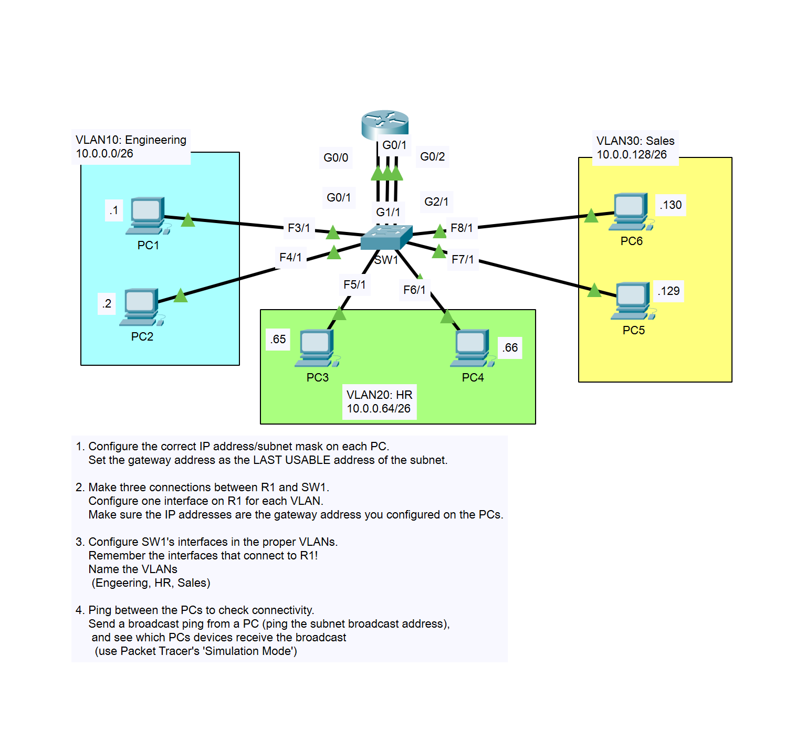
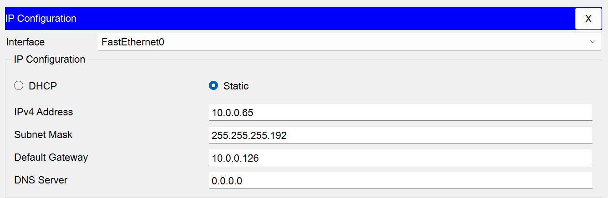
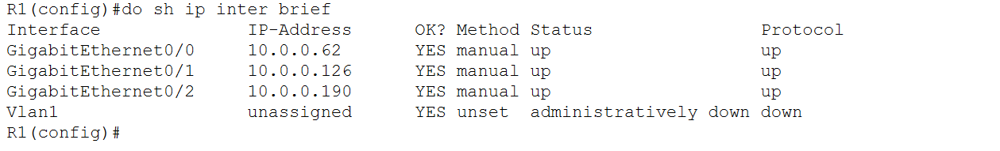
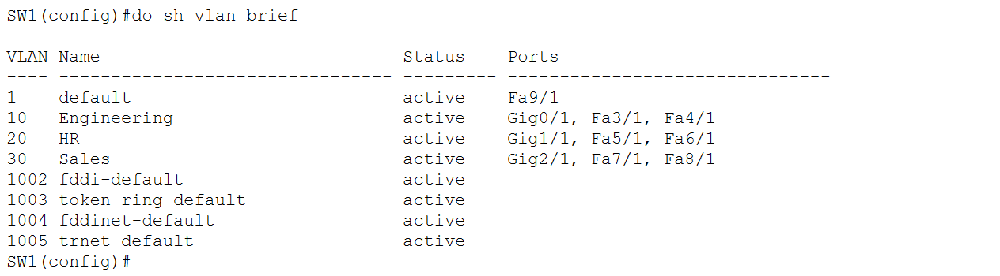
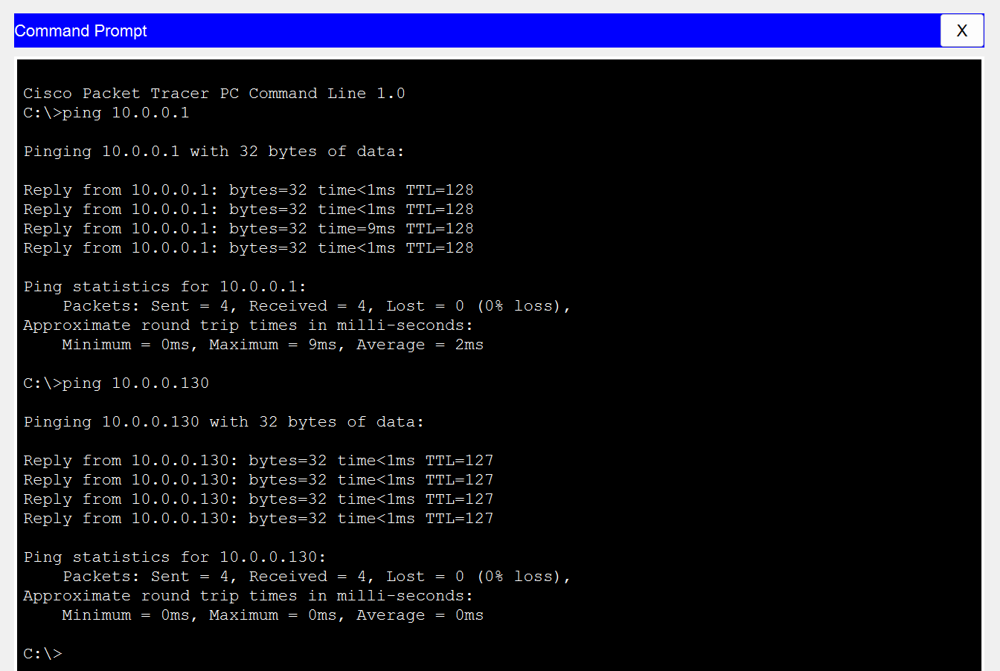

# Laboratorio de VLANs y Subredes – Documentación de Configuración

## 1. Objetivo
El objetivo de este laboratorio es configurar VLANs en un switch y subredes en un router, asignar direcciones IP a los PCs y verificar la conectividad dentro de cada VLAN. Además, se realiza un ping de broadcast para observar qué dispositivos reciben la comunicación.

---

## 2. Topología de Red
- **6 PCs** distribuidos en **3 VLANs** (2 PCs por VLAN):
  - VLAN 10: Engineering
  - VLAN 20: HR
  - VLAN 30: Sales
- **Switch SW1** con interfaces asignadas a las VLANs.
- **Router R1** con **3 interfaces físicas** conectadas al switch, una para cada VLAN.
- **Redes IP**: 10.0.0.0/26 (cada VLAN con un rango de 62 hosts).
- **Gateway de cada VLAN**: última dirección usable del rango.

**Captura de la topología:**  

---

## 3. Configuración de PCs
Cada PC se configuró con una dirección IP correspondiente a su VLAN y máscara /26. El gateway se configuró como la última dirección usable de la subred.

| VLAN       | PC   | IP Asignada    | Gateway     | Máscara           |
|------------|------|----------------|------------|-----------------|
| Engineering| PC1  | 10.0.0.1       | 10.0.0.62  | 255.255.255.192 |
| Engineering| PC2  | 10.0.0.2       | 10.0.0.62  | 255.255.255.192 |
| HR         | PC3  | 10.0.0.65      | 10.0.0.126 | 255.255.255.192 |
| HR         | PC4  | 10.0.0.66      | 10.0.0.126 | 255.255.255.192 |
| Sales      | PC5  | 10.0.0.129     | 10.0.0.190 | 255.255.255.192 |
| Sales      | PC6  | 10.0.0.130     | 10.0.0.190 | 255.255.255.192 |

**Captura de la configuración de un PC:**  

---

## 4. Configuración del Router (R1)
Se configuraron **3 interfaces físicas**, una por cada VLAN, con sus respectivas direcciones IP y estado operativo:

| Interfaz           | IP Asignada   | Estado    | Protocolo |
|-------------------|---------------|-----------|-----------|
| GigabitEthernet0/0 | 10.0.0.62     | up        | up        |
| GigabitEthernet0/1 | 10.0.0.126    | up        | up        |
| GigabitEthernet0/2 | 10.0.0.190    | up        | up        |

interface GigabitEthernet0/0\
ip address 10.0.0.62 255.255.255.192\
no shutdown

interface GigabitEthernet0/1\
ip address 10.0.0.126 255.255.255.192\
no shutdown

interface GigabitEthernet0/2\
ip address 10.0.0.190 255.255.255.192\
no shutdown

**Captura de las IPs configuradas en R1:**  

---

## 5. Configuración del Switch (SW1)
Se crearon las VLANs, se asignaron interfaces y se nombraron:

| VLAN | Nombre       | Interfaces asignadas              |
|------|-------------|----------------------------------|
| 10   | Engineering | Gig0/1, Fa3/1, Fa4/1             |
| 20   | HR          | Gig1/1, Fa5/1, Fa6/1             |
| 30   | Sales       | Gig2/1, Fa7/1, Fa8/1             |

**Comandos utilizados:**

vlan 10\
name Engineering\
vlan 20\
name HR\
vlan 30\
name Sales

interface range Fa3/1 - Fa4/1, Gi0/1\
switchport mode access\
switchport access vlan 10

interface range Fa5/1 - Fa6/1, Gi0/\
switchport mode access\
switchport access vlan 20

interface range Fa7/1 - Fa8/1, Gi0/\
switchport mode access\
switchport access vlan 30

**Captura de las VLANs configuradas en SW1:**  

---

## 6. Verificación de Conectividad
- Se realizó un **ping entre PCs de la misma VLAN** para comprobar conectividad.
- También se hizo un **ping de broadcast** para observar qué PCs reciben la comunicación.

**Captura del ping de un PC a otro:**  

**Observaciones del ping de broadcast:**  
- Solo los PCs dentro de la misma VLAN reciben el broadcast.
- Cada VLAN funciona de manera aislada gracias a la segmentación por VLAN.

---

## 7. Conclusiones
- Se logró la segmentación de la red en **3 VLANs** correctamente.
- Cada PC tiene conectividad hacia su **gateway**.
- Las conexiones físicas separadas por VLAN permiten que cada VLAN tenga su propio enlace al router.
- El ping de broadcast evidencia que los **broadcasts se limitan a la VLAN**, mostrando la efectividad de la segmentación.